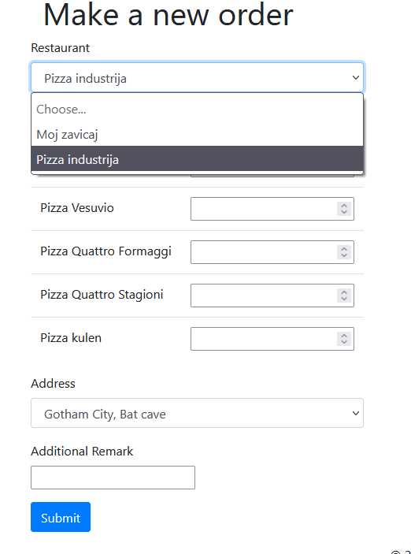
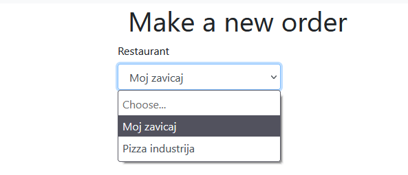
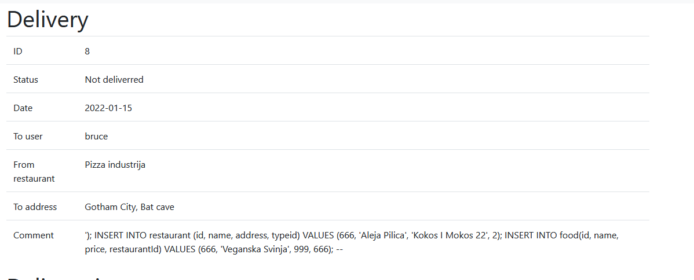

# SQLi Izvestaj

U ovom zadatku je iskoriscen SQLi napad pomocu instrukcije:

```sql

'); INSERT INTO restaurant (id, name, address, typeid) VALUES (666, 'Aleja Pilica', 'Kokos I Mokos 22', 2); INSERT INTO food(id, name, price, restaurantId) VALUES (666, 'Veganska Svinja', 999, 666); --

```


## Zastita
U resenju je uocena slabost da se konkateniraju Stringovi bez ikakve provere. 

```java

public void insertNewOrder(NewOrder newOrder, int userId) {
    LocalDate date = LocalDate.now();
    String sqlQuery = "INSERT INTO delivery (isDone, userId, restaurantId, addressId, date, comment)" +
            "values (FALSE, " + userId + ", " + newOrder.getRestaurantId() + ", " + newOrder.getAddress() + "," +
            "'" + date.getYear() + "-" + date.getMonthValue() + "-" + date.getDayOfMonth() + "', '" + newOrder.getComment() + "')";
    try {
        Connection connection = dataSource.getConnection();
        Statement statement = connection.createStatement();
        statement.executeUpdate(sqlQuery);

```
Kako bismo resili ovo, a ujedno sto manje koda izmenili, neophodno je koristiti ``` preparedStatement ``` umesto ``` createStatement ```

Kada izmenimo, dobijamo sledeci kod:

```java

public void insertNewOrder(NewOrder newOrder, int userId) {
    LocalDate date = LocalDate.now();
    String sqlQuery = "INSERT INTO delivery (isDone, userId, restaurantId, addressId, date, comment)" +
            "values (FALSE, " + userId + ", " + newOrder.getRestaurantId() + ", " + newOrder.getAddress() + "," +
            "'" + date.getYear() + "-" + date.getMonthValue() + "-" + date.getDayOfMonth() + "', '" + newOrder.getComment() + "')";
    try {
        Connection connection = dataSource.getConnection();
        Statement statement = connection.prepareStatement(sqlQuery);
        statement.executeUpdate(sqlQuery);

```

Ako bismo istestirali ovaj kod, trebalo bi da sve ostane nepromenjeno:

### PRE



### POSLE



I dobijamo gresku:



Kao rezultat, ne izvrsava se naredba!

