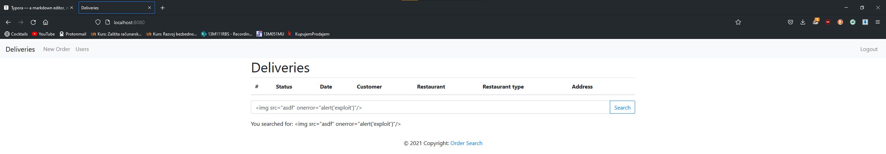

# Izvestaj o XSS i CSRF

## CSRF

```html
<script>
    function exploit() {
        let fData = new FormData()
        fData.append('username', 'Crybaby')
        fData.append('password', 'c6VdmbUp6yrR5JT7FG&t%B*YezvFeq&!DZ!gDqVz8hcCzHH@8M')
        fData.append('id', 1)
        fetch('http://localhost:8080/api/customer/update-customer', {
            method: "post",
            mode: 'no-cors',
            credentials: "include",
            headers: {
                'Content-Type': 'application/json'
            },
            body: fData
        })

    }
</script>
```

Ovaj kod se nalazi na stranici index.html od projekta csrf-exploit.

Korisik dobija obavestenje da klikne pehar sto, nakon stiska, izvrsava exploit funkciju koja poziva localhost:8080/api/customer/update-customer "u njegovo" ime i izvrsava promenu imena i lozinke za id = 1

### Zastita

Zastita se odnosi na implementaciju CSRF tokena. To je uradjeno tako sto su se metode koje zahtevaju bilo kakav vid izmene podataka na serveru na stranici za izmenu podataka o korisniku "ojacani" sa *hidden* elementom koji predstavlja taj token. Token se vezuje za samu sesiju i onda kada pristigne zahtev za, recimo, brisanjem korisnika ili adrese, mi radimo proveru pristiglog tokena i tokena koji je vezan za sesiju. Kako u ovom napadu ne mozemo da znamo token za zrtvu, ovakav napad propada. 

Koristi se ``` CsrfHttpSessionListener ``` klasa koja generise te tokene. Prvo, kada korisnik ucita stranicu profila, generisemo taj token:

```java
// CustomerController.java

@GetMapping("/customer")
public String getCustomer(@RequestParam(name = "id", required = true) String id, Model model, HttpSession session) {
    String csrfToken = session.getAttribute("CSRF_TOKEN").toString();
    model.addAttribute("CSRF_TOKEN", csrfToken); // Postavljanje tokena u prosledjen zahtev ka korisniku
    model.addAttribute("customer", customerRepository.getCustomer(id));
    model.addAttribute("addresses", customerRepository.getAddresses(id));
    return "customer";
}
```

 Potom, treba popuniti sve forme u HTML stranici:

#### Forma za menjanje Username i Password

```html
<form method="POST" action="/api/customer/update-customer" class="col-5">
    <input type="hidden" id="CSRF_TOKEN" th:value="${CSRF_TOKEN}" name="CSRF_TOKEN">
    <div class="form-group">
        <label for="username">Username</label>
        <input type="text" name="username" class="form-control" id="username" th:value="${customer.username}">
    </div>
    <div class="form-group">
        <label for="password">Password</label>
        <input type="text" name="password" class="form-control" id="password" th:value="${customer.password}">
    </div>
    <input type="hidden" name="id" class="form-control" id="id" th:value="${customer.id}">
    <button type="submit" class="btn btn-primary">Save</button>
</form>
```

#### Forma za brisanje korisnika

```HTMl
<div class="row">
    <div class="form-group">
        <button type="submit" class="btn btn-danger" id="deleteUser"
                th:onclick="'deleteCustomer(\''+ ${customer.id} +'\')'">Delete
        </button>
    </div>
</div>
```

Kako ovo nema formu kao takvu, vec poziva metodu ```deleteCustomer```, dodat je argument za CSRF Token i u prototipu funkcije:

```javascript
function deleteCustomer(customerId) {
    token = document.getElementById('CSRF_TOKEN').value
    fData = new FormData()
    fData.append('CSRF_TOKEN', token)
    fetch('/customer?id=' + customerId, {
        method: 'DELETE',
        body: fData
    }).then(function () {
        window.location.href = '/customers-and-restaurants';
    });
}
```

#### Forma za dodavanje adrese i brisanje adrese

```html
<table>
    <tr th:each="address: ${addresses}">
        <form method="POST" action="/api/customer/address/update-address" class="col-5">
            <input type="hidden" th:value="${CSRF_TOKEN}" name="CSRF_TOKEN">
            <td><input name="name" th:value="${address.name}"/>
                <input type="hidden" name="id" th:value="${address.id}"/></td>
            <td>
                <button class="btn btn-primary">Save</button>
            </td>
        </form>
        <td>
            <button class="btn btn-danger" th:onclick="'deleteAddress(\''+ ${address.id} +'\')'">Delete</button>
        </td>
    </tr>
</table>
```

Brisanje je slicno kao i za brisanje korisnika (preko JS request-a).

```javascript
function deleteAddress(addressId) {
    token = document.getElementById('CSRF_TOKEN').value
    fData = new FormData()
    fData.append('CSRF_TOKEN', token)
    fetch('/customer/address?id=' + addressId, {
        method: 'DELETE',
        body: fData
    }).then(function () {
        window.location.href = '';
    });
}
```

CSRF token bi uvek trebalo da se salje u telu paketa jer, ukoliko bismo slali kao deo URL-a (kao sto prosledjujemo id-ove) korisnik moze nekako da dodje do linka za brisanje i slucajno posalje svoj CSRF token pored ostalih informacija (ako pretpostavimo situaciju da korisnik zeli da posalje link iz nekog razlooga).

### Provera na serveru

Provera je sustinski ista, razlikuje se samo odakle dohvatamo podatke, da li iz body dela ili header dela

#### Primer dohvatanje iz tela

```java
@PostMapping("/api/customer/update-customer")
public String updateCustomer(CustomerUpdate customerUpdate, Model model, HttpSession session, @RequestParam("CSRF_TOKEN") String csrfToken)
    throws AccessDeniedException {
    String csrf = session.getAttribute("CSRF_TOKEN").toString();
    if(!csrf.equals(csrfToken)) throw new AccessDeniedException("Forbidden");
    customerRepository.updateCustomer(customerUpdate);
    customersAndRestaurants(model);
    return "/customers-and-restaurants";
}
```

#### Primer dohvatanja iz zaglavlja

```java
@DeleteMapping("/customer/address")
public String deleteCustomerAddress(@RequestParam(name = "id", required = true) String id, @RequestParam(name = "CSRF_TOKEN", required = true) String csrfToken, HttpSession session) throws AccessDeniedException {
    int identificator = Integer.valueOf(id);
    String csrf = session.getAttribute("CSRF_TOKEN").toString();
    if(!csrf.equals(csrfToken)) throw new AccessDeniedException("Forbidden");
    customerRepository.deleteCustomerAddress(identificator);
    return "/customers-and-restaurants";
}
```

### Testiranje

Prvo treba da se izmeni malo kod napadaca. Server odbija zahteve jer ocekuje da pronadje CSRF_TOKEN polje:

```html
<script>
    function exploit() {
        let fData = new FormData()
        fData.append('username', 'Crybaby')
        fData.append('password', 'c6VdmbUp6yrR5JT7FG&t%B*YezvFeq&!DZ!gDqVz8hcCzHH@8M')
        fData.append('id', 1)
        fData.append('CSRF_TOKEN', 'Ne znam token')
        fetch('http://localhost:8080/api/customer/update-customer', {
            method: "post",
            mode: 'no-cors',
            credentials: "include",
            headers: {
                'Content-Type': 'application/json'
            },
            body: fData
        })

    }
</script>
```

I nakon ulogovanja i pokusaja izvrsavanja napada, dobijamo sledeci error:


Ista ova zastita je uradjena i za brisanje korisnika, dodavanje adresa i brisanje adresa.

# XSS

Na ovom sajtu nije moguce izvrsiti XSS napad. Jedino mesto gde postoji ranjivost za XSS je na stranici *Deliveries*. Na toj stranici ima ispis pomocu ``` innerHtml``` sto ne-escapeuje karaktere i izvrsava sta procita. Mozemo da unesemo u input za pretragu nesto kao:

```html

```

Ali, nazalost, ovim samo sami sebe mozemo da povredimo, nema nacin da zrtva pokrene ovaj kod i promeni svoje kredencijale kao sto moze sa CSRF napadom.

Ovo moze da se dogodi jer pretraga na stranici koristi sledeci kod:

```html
<div class="input-group mb-3">
      <input type="text" id="searchQuery" class="form-control">
      <div class="input-group-append">
          <button class="btn btn-outline-primary" id="carSearchButton" type="button" onclick="search()">Search
          </button>
      </div>
</div>
<p class="invisible">You searched for: <span id="searchTerm"></span></p>
```

Mi ukucamo nas

```javascript
function search() {
    clearSearchResults();
    const searchQuery = getSearchQuery();
    updateSearchTerm(searchQuery);
    fetch('/api/deliveries/search?query=${searchQuery}')
        .then(response => response.json())
        .then(updateSearchResults);
}

function updateSearchTerm(searchQuery) {
     const searchTerm = document.getElementById('searchTerm');
     searchTerm.innerHTML = searchQuery;
     searchTerm.parentElement.classList.remove('invisible');
 }
```

Propust je u tome sto se koristi "innerHTML" za ispis upita, trebalo bi "innerText".

```javascript
function updateSearchTerm(searchQuery) {
    const searchTerm = document.getElementById('searchTerm');
    searchTerm.innerText = searchQuery;
    searchTerm.parentElement.classList.remove('invisible');
}
```

### Testiranje

